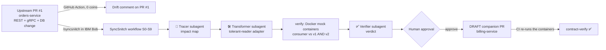
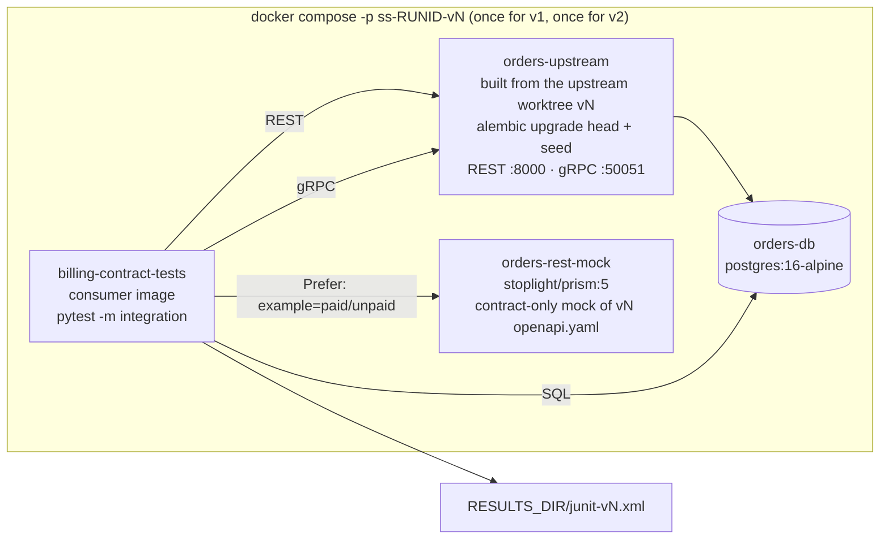
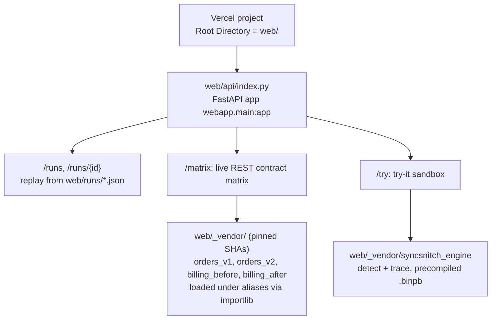

# SyncSnitch — Architecture

> **SyncSnitch** (formerly *SchemaShift*) is an autonomous, human-gated contract-drift agent built with **IBM Bob 2.0**.
> It works when an upstream pull request changes an API contract: a REST payload, a gRPC definition or a database migration.
> 1. It detects the drift and traces every downstream usage across repositories.
> 2. Bob subagents generate a backward-compatible adapter in each consumer.
> 3. SyncSnitch proves that adapter with Docker mock containers against the old **and** the new contract.
> 4. After a human approves, it opens a **draft companion PR** in the consumer repo.
>
> Track: *Release, Deployment & Application Maintenance* · Event: IBM Bob 2.0 Hackathon (lablab.ai, Sep 25–27 2026).
> How to build it: [WORK.md](WORK.md) · How it flows: [WORKFLOW.md](WORKFLOW.md) · What it does: [FEATURES.md](FEATURES.md)

---

## 1. The problem and the idea

When an upstream team changes a database schema, a gRPC message or an internal REST payload, downstream services often break **silently**. They keep running on outdated client libraries and stale assumptions until production traffic hits the new shape. Contract *detection* tools already exist (OpenAPI diff, `buf breaking`, schema registries). What doesn't exist as a commodity is the whole loop:

**detect → map the ripple across repos → generate the consumer fix → prove backward compatibility → hand a human a ready-to-merge PR.**

That loop is multi-repository, multi-step reasoning, which is exactly what IBM Bob 2.0 adds: **subagents, workflows, parallel tool calls and document understanding**.



---

## 2. Repositories and ownership

| Repo | Role | Owner | Branches |
|---|---|---|---|
| `kshiti26-11/demo` (cloned locally as `syncsnitch/`) | **SyncSnitch itself**: engine, verifier, Bob layer, CI, demo website, docs, `bob_sessions/` (the submission repo) | Persons 3 and 4 | `main` |
| `kshiti26-11/orders-service` | **Upstream**: owns the Orders contract (REST + gRPC + DB) | Person 1 | `main` = v1, `feat/orders-v2` = v2 (**PR #1, never merged**) |
| `kshiti26-11/billing-service` | **Downstream consumer**: invoices, payment status, revenue report | Person 2 | `main` = before; `syncsnitch/orders-service-pr1` = the companion PR |

Local layout on every device: `~/hack/{syncsnitch,orders-service,billing-service}`. IBM Bob opens `syncsnitch/syncsnitch.code-workspace`, a **multi-root workspace** with all three repos, which gives Bob cross-repository context.

```
syncsnitch/  (kshiti26-11/demo)
├── ARCHITECTURE.md  WORK.md  WORKFLOW.md  FEATURES.md  README.md
├── contracts/reference/     frozen v1/v2 contracts, migrations, seed, change-proposal .docx (single source of truth)
├── templates/               validated boilerplate copied into the service repos + the Bob layer (templates/bob/.bob)
├── syncsnitch/              Python package (engine + verify)
│   ├── cli.py  gitutil.py
│   ├── detect/  openapi.py proto.py migrations.py      (Person 3)
│   ├── trace/   python_ast.py files.py                 (Person 3)
│   ├── report/  templates/pr_body.md.j2 comment.md.j2  (Person 3)
│   ├── runs/                                           (Person 3)
│   └── verify/  cli.py runner.py …                     (Person 4)
├── verify/docker-compose.yml   the mock-container topology (frozen)
├── .bob/                       custom modes, workflow skill, commands, rules, hooks, MCP (installed in P3-2)
├── scripts/                    open_companion_pr.sh, vendor_demo_code.sh, reset_demo.sh, bob_hooks/, smoke/try-it helpers
├── web/                        Vercel demo site (FastAPI + Jinja2): webapp/, templates/, static/, runs/, _vendor/
├── tests/                      engine/, verify/, website/
├── .github/workflows/          ci.yml, syncsnitch-detect.yml, syncsnitch-verify.yml, health.yml
└── bob_sessions/               exported Bob task histories + screenshots (hackathon requirement)
```

**Stack:** Python 3.12 · uv · FastAPI · Pydantic v2 · httpx · grpcio / grpcio-tools / protobuf 7 · SQLAlchemy 2 + Alembic · PostgreSQL 16 (containers) / SQLite (tests) · pytest · Docker Compose · Stoplight Prism · GitHub Actions · Vercel.

---

## 3. The contracts: one upstream PR changes three surfaces

The authoritative files are in [`contracts/reference/`](contracts/reference). The upstream copies them; nobody retypes them.

### 3.1 REST: `GET /orders/{order_id}` (OpenAPI 3.1)
| | v1 ([`v1/openapi.yaml`](contracts/reference/v1/openapi.yaml)) | v2 ([`v2/openapi.yaml`](contracts/reference/v2/openapi.yaml)) |
|---|---|---|
| customer | `customer_name: string` | `customer: {customer_id, display_name}` |
| money | `total_price: number` (19.99) | `total: {amount_minor: 1999, currency: "USD"}` |
| status | `PENDING \| PAID \| SHIPPED \| CANCELLED` | `AWAITING_PAYMENT \| PAID \| SHIPPED \| CANCELLED` |
| new | — | optional `shipping_eta` |

Both specs carry named examples **`paid`** (o-1001) and **`unpaid`** (o-1002) with identical names in both versions. The Prism mock serves them via `Prefer: example=<name>`.

### 3.2 gRPC: `orders.OrderLookup/GetOrderSummary` (proto3)
| field # | v1 ([`v1/orders.proto`](contracts/reference/v1/orders.proto)) | v2 ([`v2/orders.proto`](contracts/reference/v2/orders.proto)) |
|---|---|---|
| 1 | `string order_id` | `string order_id` |
| 2 | `string customer_name` | **removed, `reserved`** |
| 3 | `double total_price` | **removed, `reserved`** |
| 4 | `OrderStatus status` | `OrderStatus status` (value 1 renamed `ORDER_STATUS_AWAITING_PAYMENT`, same number) |
| 5 | — | `Customer customer` |
| 6 | — | `Money total` |
| 7 | — | `string shipping_eta` |

### 3.3 DB: Alembic migrations (batch mode, so they run on SQLite and PostgreSQL)
- [`0001_create_orders.py`](contracts/reference/migrations/0001_create_orders.py) creates `orders(order_id, customer_name, total_price NUMERIC(10,2), status, created_at)`.
- [`0002_money_customer_status.py`](contracts/reference/migrations/0002_money_customer_status.py) does the following, and its `downgrade()` restores v1:
  - adds `total_minor` (= `ROUND(total_price×100)`), `currency` (default `USD`), `customer_id` (= `'c-' || SUBSTR(order_id,3)`) and `shipping_eta`;
  - renames `customer_name` → `customer_display_name`;
  - drops `total_price`;
  - updates `PENDING` → `AWAITING_PAYMENT`.

### 3.4 Seed data and the numbers every test uses
| order | customer | amount (minor) | v1 status | v2 status |
|---|---|---|---|---|
| o-1001 | Ada Lovelace | 1999 | PAID | PAID |
| o-1002 | Alan Turing | 500 | PENDING | AWAITING_PAYMENT |
| o-1003 | Grace Hopper | 12050 | SHIPPED | SHIPPED (`shipping_eta` 2026-09-05T12:00:00Z) |
| o-1004 | Edsger Dijkstra | 4200 | CANCELLED | CANCELLED |

- **Invoice for o-1001:** subtotal **1999**, tax 8.25% half-up **165**, total **2164**.
- **o-1002 is not payable:** HTTP **409**.
- **Revenue (PAID + SHIPPED):** `[{"day":"2026-09-01","revenue_minor":1999}, {"day":"2026-09-03","revenue_minor":12050}]`.

---

## 4. What breaks downstream, and how the fix works

billing-service consumes all three surfaces:

| billing endpoint | depends on | against v2 **before** the fix | failure |
|---|---|---|---|
| `POST /invoices/{order_id}` | REST → `OrderDTO` → `build_invoice` | `customer_name`/`total_price` are missing → validation error → **HTTP 500** | **loud** |
| *(hidden in the same path)* | `NOT_PAYABLE = {"PENDING", "CANCELLED"}` | `AWAITING_PAYMENT` isn't in the set → unpaid orders would be invoiced once the loud error is patched | **silent** |
| `GET /payments/{order_id}/status` | gRPC with **outdated vendored stubs** (v1 proto) | fields 2/3 aren't sent → `total_price` decodes as `0.0` → `amount_minor: 0`, no error | **silent** |
| `GET /reports/revenue` | raw SQL `SUM(total_price)` | column dropped → `UndefinedColumn` → **HTTP 500** | **loud** |

**Tolerant-reader fix.** The Transformer writes it following [`templates/bob/.bob/rules-syncsnitch-transformer/tolerant-reader.md`](templates/bob/.bob/rules-syncsnitch-transformer/tolerant-reader.md). billing must work with v1 **and** v2 during a rolling deploy, with its own API unchanged:
- **REST:** `billing/adapters/orders_contract.py` normalises both payload shapes into one `OrderView`. `PENDING` and `AWAITING_PAYMENT` both mean "not payable".
- **gRPC:** a **consumer-compat proto**. The consumer vendors the v2 proto but re-declares the removed fields 2 and 3 as `[deprecated = true]`. Upstream only *reserved* those numbers, so this is wire-safe and one stub set reads both server versions. The code prefers `total`/`customer` when `HasField(...)` is true.
- **SQL:** read `alembic_version` and pick `revenue_v1.sql` or `revenue_v2.sql`.

**Validated before these docs were written** (throwaway implementations in real Python and Docker; see §12):

| | orders v1 | orders v2 |
|---|---|---|
| billing **before** | 5/5 integration tests pass | **0/5 pass** (REST 500, gRPC amount 0, SQL error, Prism example parse) |
| billing **after** (tolerant reader) | 5/5 pass | **5/5 pass** |

---

## 5. SyncSnitch components

### 5.1 Engine: deterministic, 0 tokens at run time (Person 3, prompt P3-1)
| Command | Does | Output |
|---|---|---|
| `syncsnitch detect --upstream DIR --base REF --head REF` | OpenAPI schema diff (with `$ref` resolution); protobuf **descriptor-set** diff by field and enum **number** (compiled with grpcio-tools and never registered in a descriptor pool); Alembic `upgrade()` AST parse (add/drop/rename columns, `UPDATE … SET x='NEW' WHERE x='OLD'`) | `drift.json`: a list of `Change {id, surface, kind, location, old, new, breaking, note}` |
| `syncsnitch trace --run-id ID --consumer DIR` | finds every consumer usage of each breaking change's `old` token: Python AST (subscripts, `.get`, attributes, Pydantic fields, keywords, literals), SQL files, vendored `.proto`, JSON fixtures; maps each hit to the **FastAPI endpoint** it breaks via a 3-hop reference graph | `candidates.json`: `Hit {file, line, token, change_ids, usage_kind, symbol, endpoints, in_tests}` |
| `syncsnitch report --format pr\|comment` | Jinja2 PR body / CI comment from all run JSON files | `pr_body.md` / `comment.md` |
| `syncsnitch run-artifact` | bundles drift, impact, verification, verdict, diff and steps for the website | `web/runs/<run_id>.json` |

Expected drift for the demo: **9 breaking changes**, 3 per surface.
- **REST:** `Order.customer_name` and `Order.total_price` removed; `OrderStatus.PENDING` removed.
- **gRPC:** `OrderSummary.2` and `.3` removed; `OrderStatus.1` renamed.
- **DB:** `orders.customer_name` renamed; `orders.total_price` dropped; `orders.status.PENDING` renamed.

### 5.2 Verifier: the deterministic judge behind Subagent 3 (Person 4, prompt P4-1)
`syncsnitch verify --run-id ID --upstream ../orders-service --base main --head feat/orders-v2 --consumer ../billing-service` works in three phases:
1. It creates **git worktrees** of the upstream at v1 and v2.
2. It runs these checks. The model never overrides a failing check.

| Check | What | Pass rule |
|---|---|---|
| **V1** | consumer unit tests | `uv run pytest -q` exits 0 |
| **V2** | v2 fixtures match the new contract | every `tests/fixtures/*v2*.json` validates against v2 `Order` |
| **V3** | consumer vs **upstream v1** (backward compatible) | compose run with `CONTRACT_VERSION=v1`: JUnit all green |
| **V4** | consumer vs **upstream v2** (new contract) | same with v2. Business values are asserted, so silent breaks fail |
| **V5** | Prism contract examples | `test_rest_contract_examples_parse` green in both runs |
| **V6** | diff scope | only `billing/`, `contracts/upstream/`, `tests/`, `scripts/`, `README.md`, `.syncsnitch.json` changed; no test deleted |

3. It writes `verification.json` and `VERIFICATION.md`, and exits 0 only when every check is green.

### 5.3 The Bob layer (Person 3, prompt P3-2; files in [`templates/bob/.bob/`](templates/bob/.bob))
| Piece | File | Role |
|---|---|---|
| 🕵️ **SyncSnitch** mode | `.bob/custom_modes.yaml` | orchestrator: runs the skill, executes deterministic steps, delegates AI steps, stops at the human gate |
| 🔎 **Schema Diff & AST Tracer** (Subagent 1) | same | turns drift + candidates + the upstream **change-proposal .docx** (document understanding) into `impact.json`; fans out parallel `explore` subagents |
| 🛠️ **Downstream Code Transformer** (Subagent 2) | same + `.bob/rules-syncsnitch-transformer/tolerant-reader.md` | refactors consumer serialization, client stubs, SQL and mocks/fixtures on a `syncsnitch/*` branch |
| ✅ **Contract Verifier** (Subagent 3) | same | runs/reads `syncsnitch verify`, writes `verdict.json` with concrete fix instructions; max 1 fix loop; never edits code |
| Workflow | `.bob/skills/syncsnitch-workflow/SKILL.md` | S0–S9, mixing deterministic steps, AI steps and the human gate (see [WORKFLOW.md](WORKFLOW.md)) |
| Commands | `.bob/commands/syncsnitch.md`, `evidence.md` | `/syncsnitch <PR-url> [consumer]`, `/evidence` |
| Rules | `.bob/rules/00-syncsnitch-guardrails.md` | never merge, draft PRs only, deterministic checks decide, coin hygiene |
| Hooks | `.bob/settings.json` → `scripts/bob_hooks/guard.py`, `logger.py` | PreToolUse **guard**: while `.syncsnitch/ACTIVE` exists, blocks writes to the upstream repo and to secrets. PostToolUse/Stop **logger**: per-device JSONL in `bob_sessions/raw/` |
| MCP (optional) | `.bob/mcp.json` | GitHub MCP server (`repos,pull_requests` toolsets), **disabled by default** to save tokens; the default PR path is `scripts/open_companion_pr.sh` (`gh`) |

---

## 6. Verification topology (Docker mock containers)



- **File:** [`verify/docker-compose.yml`](verify/docker-compose.yml). Env: `UPSTREAM_DIR`, `CONSUMER_DIR`, `RESULTS_DIR`, `CONTRACT_VERSION`.
- **Run:** `up --build --abort-on-container-exit --exit-code-from billing-contract-tests`, then always `down -v`.
- **Prism must run with `--multiprocess=false`.** The default multi-process mode crashes on start in the current image, which validation caught.
- **The consumer's integration tests** ([`templates/billing-service/tests/integration/test_contract.py`](templates/billing-service/tests/integration/test_contract.py)):
  - They read only env vars (`ORDERS_REST_URL`, `ORDERS_REST_MOCK_URL`, `ORDERS_GRPC_ADDR`, `REPORTS_DB_URL`).
  - They assert identical business results for v1 and v2, so the same test file proves both backward compatibility (V3) and the new contract (V4).
- **Each service repo has a `.dockerignore`**, so local `.venv` folders never enter the build context.

---

## 7. CI/CD

| Workflow | Where | Trigger | Does |
|---|---|---|---|
| `syncsnitch.yml` → `syncsnitch-detect.yml` (reusable) | orders-service → demo | upstream PR touching `contracts/**` or `migrations/**` | detect + trace + comment. **Deterministic, 0 coins.** Posts or updates one comment on the upstream PR with the drift table and the affected consumer files and endpoints |
| `contract-verify.yml` → `syncsnitch-verify.yml` (reusable) | billing-service → demo | PRs from `syncsnitch/*` branches | reads `.syncsnitch.json`, checks out the upstream refs, runs `syncsnitch verify` (the same containers) → status check + job summary |
| `ci.yml` | each repo | push / PR | unit tests |
| `health.yml` | demo | every 30 min (when `DEMO_URL` is set) | `scripts/smoke_demo_url.py`; opens an issue on failure |

All workflows pass `actionlint` + `shellcheck`. **All three repos must be public** so the reusable workflows and checkouts work across repos.

---

## 8. Demo website (Vercel)



- **Replay:** the S1–S9 timeline, drift by surface, a Mermaid impact map, the diff (diff2html), verification V1–V6, and links to PR #1, the companion PR and `bob_sessions`.
- **Live contract matrix:** orders v1/v2 and billing before/after are **mounted in-process** under aliases (`importlib` + relative imports). They're wired with `httpx.ASGITransport` and seeded in-memory SQLite, so there are no network hops and no database server. The cells are live **REST** calls. gRPC and DB results come from the recorded container run.
- **Try-it:** 4 prebaked contract changes (REST field rename, REST enum rename, gRPC fields removed, DB column changes). The vendored engine runs detect + trace live in under 1 s.
- **Why the site never imports gRPC stubs:** two versions of `orders.proto` in one process clash in the protobuf descriptor pool ("duplicate file name orders.proto", reproduced in validation). All REST modules import gRPC lazily, and the engine only parses descriptor bytes. `web/requirements.txt` therefore has no `grpcio`.
- **Robust unattended hosting:** Vercel serverless (no sleeping container), a read-only filesystem, and no secrets. `scripts/vendor_demo_code.sh` pins SHAs in `web/_vendor/PINS.json`.

---

## 9. Run artifacts and data flow

Everything for one run lives in `.syncsnitch/runs/<RUN_ID>/` (git-ignored, readable by Bob):

| File | Written by | Read by |
|---|---|---|
| `drift.json` | S1 `detect` | trace, Tracer, report, site |
| `candidates.json` | S2 `trace` | Tracer, report |
| `change-proposal.docx` | S2 (`git show` from the upstream branch) | Tracer (**document understanding**) |
| `impact.json` | S3 🔎 Tracer | Transformer, report |
| `upstream-v1/`, `upstream-v2/` (worktrees, removed after), `results/junit-v*.xml` | S5 `verify` | verify |
| `verification.json`, `VERIFICATION.md` | S5 `verify` | Verifier, report, gate, site |
| `verdict.json` | S6 ✅ Verifier | report, gate |
| `pr_body.md` | S8 `report` | `open_companion_pr.sh` |
| `web/runs/<RUN_ID>.json` | S9 `run-artifact` | demo site |
| `billing-service/.syncsnitch.json` | S4 Transformer | the companion PR's CI |

---

## 10. Safety and governance
- **The human gate is mandatory (S7).** It offers four choices: approve, show diff, request changes, abort. PRs are always **draft**, and SyncSnitch never merges anything.
- **Deterministic checks decide pass/fail.** The Verifier explains, it doesn't grade itself.
- **Guard hook:** during a run, writes to the upstream repo or to secret-looking files are blocked. The logger records metadata only.
- **Scope check (V6):** the consumer diff must stay inside the allowed folders.
- **No secrets in any repo.** `gh` uses the developer's own login. The MCP token, if used, lives in the global Bob config.

## 11. Cost architecture (40 Bobcoins for the whole team)
- **Heavy lifting is deterministic** and costs **0 coins**: detect, trace, verify (containers), PR creation, run artifact, CI comments.
- **Only three steps call the model:** S3 Tracer, S4 Transformer and S6 Verifier, each in a fresh, focused context (subagents).
- **Building the project** takes 10 short, spec-exact prompts (see [WORK.md](WORK.md)). They copy validated boilerplate with `cp` instead of generating it.
- **MCP servers stay disabled.** Every enabled server's tool list is re-sent on every request.

## 12. What was validated before handing this to the team
| Claim | How it was checked |
|---|---|
| Both OpenAPI specs are valid, and every example matches its schema | `openapi-spec-validator` + `jsonschema` |
| Both protos compile; the descriptor diff finds exactly 2/3 removed, 5/6/7 added, enum 1 renamed | grpcio-tools 1.84 + protobuf 7 |
| **Silent gRPC break:** v1 stubs read a v2 message as `total_price = 0.0` with no error | real serialization round-trips |
| **Compat proto:** one stub set reads 1999 from both v1 and v2 servers; v1 `PENDING` decodes as `AWAITING_PAYMENT` | same |
| Migrations 0001 → 0002 → downgrade on **SQLite and PostgreSQL 16**; v1 SQL on the v2 schema fails loudly | Alembic runs + queries |
| Full container topology: before×v2 fails 5/5; after passes 5/5 on v1 and v2 | throwaway services + `docker compose` runs |
| Prism named examples + `Prefer` header; **`--multiprocess=false` required** | real `stoplight/prism:5` container |
| In-process matrix: 4 package copies side by side, no pb2 loaded, nested `ASGITransport` | throwaway site run |
| Generated-stub import patch works when the package is loaded under an alias | real gRPC call over a channel |
| All workflows and shell scripts | `actionlint` + `shellcheck` |
| Shared `pyproject.toml` + `uv.lock` resolve and import | `uv lock`, `uv sync --frozen` |

What hasn't been verified yet: Bob's own config schema, Vercel's runtime, and the GitHub Actions runtime. Each is covered by a stop/adapt instruction in WORK.md.

## 13. Limitations and roadmap
- **Demo scope:** one upstream, one consumer, Python consumers only, and the tracer is heuristic (AST + text) with 3-hop endpoint mapping.
- **Roadmap:**
  - **Fan-out:** N consumers, which means N companion PRs.
  - **More contract types:** `buf breaking` for large proto estates, Avro/Schema Registry, GraphQL.
  - **Other languages:** TypeScript and Java tracers.
  - **Headless runs:** Bob Shell (`bob -p "/syncsnitch …"`) inside the upstream PR workflow, with a GitHub Environment approval as the human gate.
  - **Cleanup PR:** removes the v1 paths once the upstream rollout completes.
