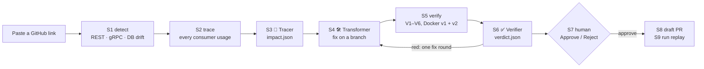

# SyncSnitch

**An autonomous, human-gated contract-drift agent built with IBM Bob 2.0.**

When an upstream team changes an API contract (a REST payload, a gRPC message or a database migration), the services
that consume it break. Some break loudly with HTTP 500s. Others break **silently** and keep returning wrong data.
SyncSnitch closes the whole loop:

**detect the drift → trace every downstream usage → write a backward-compatible fix → prove it against the old *and*
new contract in containers → open a draft PR after a human approves.**

*IBM Bob 2.0 Hackathon (lablab.ai, Sep 25–27 2026) · track: Release, Deployment & Application Maintenance.*

| | |
|---|---|
| **Live site** | https://demo-kshiti26-11.vercel.app |
| **The upstream change** | [`15f95af...main`](https://github.com/Kshiti26-11/Demo/compare/15f95af008e5...main): orders-service v1 → v2 |
| **Draft PR opened by SyncSnitch** | [#6](https://github.com/Kshiti26-11/Demo/pull/6): all six checks green, Docker included. The earlier [#5](https://github.com/Kshiti26-11/Demo/pull/5) and [#4](https://github.com/Kshiti26-11/Demo/pull/4) ran without Docker (V3–V5 skipped). |
| **Run replays** | `/runs` on the site, recorded in [`web/runs/`](web/runs) |
| **Deeper docs** | [ARCHITECTURE.md](ARCHITECTURE.md) · [WORKFLOW.md](WORKFLOW.md) · [FEATURES.md](FEATURES.md) · [WORK.md](WORK.md) |

---

## The demo scenario

This repo holds two small Python services and the agent that keeps them in sync:

- **`orders-service/`** is the **upstream**. It owns the Orders contract on three surfaces: REST (OpenAPI), gRPC
  (protobuf) and its database (Alembic). v1 is commit `15f95af`; `main` carries v2.
- **`billing-service/`** is the **consumer**. It reads orders over all three surfaces and still speaks v1.

One upstream change moves money to minor units, turns the customer into an object and renames `PENDING` to
`AWAITING_PAYMENT`:

| Surface | v1 | v2 |
|---|---|---|
| REST `GET /orders/{id}` | `customer_name`, `total_price: 19.99`, status `PENDING` | `customer: {customer_id, display_name}`, `total: {amount_minor: 1999, currency}`, status `AWAITING_PAYMENT` |
| gRPC `OrderSummary` | field 2 `customer_name`, field 3 `total_price` | fields 2 and 3 `reserved`; new `customer` (5), `total` (6), `shipping_eta` (7) |
| DB `orders` table | `customer_name`, `total_price` | `customer_display_name`, `total_minor`, `currency`; `total_price` dropped |

What that does to billing-service:

| billing endpoint | against v2 | failure |
|---|---|---|
| `POST /invoices/{order_id}` | `customer_name` / `total_price` are missing → validation error → HTTP 500 | **loud** |
| *(same path)* | `NOT_PAYABLE = {"PENDING", ...}` no longer matches `AWAITING_PAYMENT` → unpaid orders get invoiced | **silent** |
| `GET /payments/{order_id}/status` | the v1 gRPC stubs read the retired field 3 as `0.0` → `amount_minor: 0`, no error | **silent** |
| `GET /reports/revenue` | `SUM(total_price)` on a dropped column → HTTP 500 | **loud** |

The fix SyncSnitch writes is a **tolerant reader**: billing keeps its own API and works with v1 *and* v2 during a
rolling deploy. That means a REST adapter, a consumer-side proto that re-declares the retired fields as `deprecated`
(wire-safe, so one stub set reads both servers), and SQL chosen by the database's `alembic_version`.

| verification | vs orders v1 | vs orders v2 |
|---|---|---|
| billing **before** | 5/5 | **0/5** |
| billing **after** (the draft PR) | 5/5 | **5/5** |

---

## How a run works



| Step | Who | What happens |
|---|---|---|
| S0–S2 | code | find the upstream (contract owner) and the consumer, diff the contracts, trace every usage to the endpoint it breaks |
| S3 | **agent** Tracer | reads the drift, the scanner's hits and the upstream's change-proposal `.docx`; writes `impact.json` (loud vs silent) |
| S4 | **agent** Transformer | writes the tolerant reader on branch `syncsnitch/<run_id>` and commits it with the unit tests green |
| S5 | code | `syncsnitch verify`: checks V1–V6 below |
| S6 | **agent** Verifier | turns the checks into `verdict.json`; if red, sends fix instructions back to S4 once |
| S7 | **you** | Approve or Reject on the run page. A red run can't be approved. |
| S8–S9 | code | push the branch, open a **draft** PR, save the run for the replay page |

**The rule:** AI investigates and writes the fix. Code decides pass or fail. A person signs off. Only S3, S4 and S6 call
a model; every other step is deterministic and costs nothing.

### The checks (S5)

| Check | What it proves |
|---|---|
| **V1** | the consumer's unit tests pass (`uv run pytest -q`) |
| **V2** | every `tests/fixtures/*v2*.json` validates against the v2 schema |
| **V3** | the consumer's contract tests pass against **upstream v1** in containers (backward compatible) |
| **V4** | the same tests pass against **upstream v2** in containers. They assert business values (amount 1999, 409 for unpaid, revenue rows), so silent breaks fail. |
| **V5** | the REST examples served by a Prism contract mock parse in both runs |
| **V6** | the diff stays inside the consumer, deletes no test, and leaves the existing fixtures and contract tests (`tests/integration/test_*`) unchanged |

V3–V5 run in Docker Compose ([`verify/docker-compose.yml`](verify/docker-compose.yml)): Postgres 16, the upstream
built at v1 or v2 (REST + gRPC), a Prism mock and the consumer's test runner. Without Docker they are reported as
**skipped**, never as passed. A model can't overrule a failing check.

---

## The three agents

The agents are the custom modes in [`.bob/custom_modes.yaml`](.bob/custom_modes.yaml), with their rules in
[`.bob/rules/`](.bob/rules) and [`.bob/rules-syncsnitch-transformer/tolerant-reader.md`](.bob/rules-syncsnitch-transformer/tolerant-reader.md).
The same definitions run on one of these engines (`SYNCSNITCH_AGENT_BACKEND`):

| Engine | How | Budget per run |
|---|---|---|
| **IBM Bob** | headless IBM Bob Shell: `bob run --mode syncsnitch-tracer …` | Bobcoins (`SYNCSNITCH_BOB_BUDGET`, default 5) |
| **Gemini** (free tier) | Google AI Studio, OpenAI-compatible API | tokens (`SYNCSNITCH_TOKEN_BUDGET`, default 3,000,000) |
| **Groq** (free tier) · **Grok** (xAI) · **Claude** (Anthropic) | their APIs | tokens |

API engines run through [`web/webapp/llm_agent.py`](web/webapp/llm_agent.py) with sandboxed tools. They can read the
workspace except `.env*` and `.git`. The Tracer may write only `impact.json` and the Verifier only `verdict.json`. The
Transformer may write only inside the consumer. Commands are limited to `uv run pytest`, the stub generator and git.
API keys never reach those commands.

The run page names the engine and model behind every agent, and every agent commit carries a trailer (`Bob-Session:`
or `SyncSnitch-Agent: Gemini gemini-3.5-flash (<run>)`). With Gemini, `SYNCSNITCH_GEMINI_FALLBACK_MODELS` takes over
when a model's free daily quota runs out. Model strength matters: the run with all six checks green in Docker came
from `gemini-3.5-flash`, and runs on the weakest fallback (`gemini-3.1-flash-lite`) ended red. A red run keeps the
gate closed, so nothing is published.

The runner doesn't rely on the model to notice everything. It adds any scanner hit the Tracer leaves out back into
`impact.json`, and gives the Transformer a checklist of every breaking surface and affected file. It gives the
Verifier and the fix round the failing assertion from the contract tests (e.g. `amount_minor 0 != 1999`) and the files
the branch hasn't changed yet. It also tells them to fix the code, never the test.

---

## The website

A FastAPI + Jinja2 app in [`web/`](web), deployed on Vercel. Each page has a detective name with its technical
meaning under it:

| Page | Name | What it does |
|---|---|---|
| `/` | **Open a case** · run the 3 agents | paste a repo, `/pull/<n>`, `/tree/<branch>` or `/compare/<a>...<b>` link and press Enter |
| `/live/<run_id>` | live run | S1–S9 tracker, the three agent cards, the live agent log, the diff, the checks, Approve / Reject |
| `/runs` | **Case files** · runs replay | every recorded run: timeline, drift, impact map, diff, V1–V6, PR links |
| `/matrix` | **The lineup** · live matrix | billing before/after × orders v1/v2, real REST calls in-process; gRPC and DB from the last container run |
| `/try` | **Commit a crime** · try-it sandbox | four prebaked contract changes, detect + trace live in under a second |
| `/analyze` | **Stakeout** · repo analyzer | the full S1–S2 tables for any repo; pick upstream, consumer, base and head by hand, then start S3–S9 |

---

## Where the agents run

**On a laptop**, the site is also the runner. It clones the repo into `.syncsnitch/work/<run_id>`, runs the agents
and verify there, and opens the draft PR with your `gh` login after you approve.

**On Vercel** there is no machine to run on. After S1–S2 the site dispatches
[`.github/workflows/syncsnitch-agents.yml`](.github/workflows/syncsnitch-agents.yml) in a runner repo
(default `Cybverse-Pkians/syncsnitch-runner`). That job runs the same runner, Docker checks included, and pushes a
snapshot of the run to the branch `syncsnitch-live/<run_id>` every few seconds; the page reads it from there.
Approve and Reject dispatch a second job that finishes S8–S9. See [`web/webapp/cloud.py`](web/webapp/cloud.py).

**In the IBM Bob IDE**, `/syncsnitch [link]` runs the same S0–S9 workflow as a Bob skill
([`.bob/skills/syncsnitch-workflow/SKILL.md`](.bob/skills/syncsnitch-workflow/SKILL.md)) and stops at the human gate.

Other workflows in [`.github/workflows/`](.github/workflows):

| Workflow | Does |
|---|---|
| `ci.yml` | the root test suite on pushes to `main` and on every PR |
| `syncsnitch-analyze.yml` | S1, S2 and the Docker checks for any public repo, started from `/analyze` |
| `syncsnitch-detect.yml`, `syncsnitch-verify.yml` | reusable: a drift comment on upstream PRs, container checks on companion PRs. They're called from the services' own workflows when each service lives in its own repo. |
| `health.yml` | smoke-tests the demo URL every 30 minutes (set the `DEMO_URL` variable) |

---

## Quickstart

You need Python 3.12+, [uv](https://docs.astral.sh/uv/), git and the GitHub CLI (`gh auth login`). Docker is
optional; without it V3–V5 are skipped.

```bash
git clone https://github.com/Kshiti26-11/Demo.git syncsnitch && cd syncsnitch
```
```bash
uv sync --frozen
```

Pick an engine once. Each script saves its key in `.env.local` (gitignored, typed hidden):

```bash
bash scripts/gemini_setup.sh
```

The others are `bob_setup.sh` (installs IBM Bob Shell, key, license), `groq_setup.sh`, `grok_setup.sh` and
`claude_setup.sh`. Then start the site:

```bash
bash scripts/run_site.sh
```

Open http://localhost:8000, paste `https://github.com/kshiti26-11/demo` and press Enter.

**Docker on a Mac without Docker Desktop:** `brew install colima docker docker-compose docker-buildx`, add
`"cliPluginsExtraDirs": ["/opt/homebrew/lib/docker/cli-plugins"]` to `~/.docker/config.json`, then
`colima start --cpu 2 --memory 4` (again after every reboot).

**The cloud runner, once:** `bash scripts/cloud_setup.sh` creates the runner repo and copies your engine key and
settings into its Actions secrets. Then add `GITHUB_TOKEN` (Actions: write on the runner repo) to the Vercel project
and redeploy.

### The engine on the command line

Every step of S1, S2 and S5 is a CLI command and works on a repo root or a monorepo folder:

```bash
uv run syncsnitch detect --upstream orders-service --base 15f95af --head main --run-id dry-1
```
```bash
uv run syncsnitch trace --run-id dry-1 --consumer billing-service
```
```bash
uv run syncsnitch verify --run-id dry-1 --upstream orders-service --base 15f95af --head main --consumer billing-service --consumer-base main
```

Results land in `.syncsnitch/runs/dry-1/`: `drift.json` (9 breaking changes, 3 per surface), `candidates.json`,
`verification.json` and `VERIFICATION.md`. `syncsnitch report` and `syncsnitch run-artifact` render the PR body and
the replay file.

### Tests

```bash
uv run pytest -q
```

The root suite covers the engine, the verifier and the website; the agents are replaced by stand-ins
(`tests/website/fake_bob.py`), so it spends no Bobcoins or tokens. Each service has its own suite: run
`uv run pytest -q` inside `orders-service/` or `billing-service/`.

---

## Analyze your own repo

SyncSnitch runs on any GitHub repo that holds both services:

- **The upstream** has `contracts/openapi.yaml`, a `.proto` directly in `contracts/`, and/or Alembic migrations in
  `migrations/versions/`. It also needs a commit that changes them. Paste a `/pull/<n>` or `/compare/<a>...<b>` link,
  or SyncSnitch picks the latest contract commit.
- **The consumer** is another folder with a `pyproject.toml`. Its tests run with `uv run pytest -q`, and its `.py`,
  `.sql` or `.proto` files or JSON fixtures actually use the changed fields.
- **Optional:** a `Dockerfile` in both services plus Docker on the runner, for V3–V5. Private repos need `GITHUB_TOKEN`
  on the server.

Not supported yet: consumers in languages other than Python, and contracts in other paths.

---

## IBM Bob in this project

| Bob 2.0 feature | Where |
|---|---|
| **Custom modes** | 🕵️ SyncSnitch orchestrator + the three agents: [`.bob/custom_modes.yaml`](.bob/custom_modes.yaml) |
| **Subagents** | Tracer, Transformer and Verifier each run in their own context |
| **Workflow skill + slash commands** | S0–S9 in [`.bob/skills/syncsnitch-workflow/`](.bob/skills/syncsnitch-workflow), `/syncsnitch` and `/evidence` in [`.bob/commands/`](.bob/commands) |
| **Rules** | guardrails (never merge, draft PRs only, checks decide) and the tolerant-reader rules |
| **Lifecycle hooks** | [`scripts/bob_hooks/guard.py`](scripts/bob_hooks/guard.py) blocks writes to the upstream and to secrets during a run; `logger.py` records every tool call |
| **Document understanding** | the Tracer reads the upstream's change proposal `.docx` ([`orders-service/docs/`](orders-service/docs)) |
| **Headless IBM Bob Shell** | the website runs the agents with `bob run` (`web/webapp/agents.py`) |
| **Evidence** | exported Bob tasks in [`bob_sessions/exports/`](bob_sessions/exports); commits made in Bob carry a `Bob-Session:` trailer |

---

## Safety

- **A human approves every PR.** PRs are always drafts, and SyncSnitch never merges anything.
- **Deterministic checks decide.** A failing check makes the verdict red whatever the model says, and a red run can't
  be approved.
- **The upstream is read-only** during a run (write-guard hook, sandboxed tools, V6).
- **Tests can't be bent to fit.** Editing an existing fixture or contract test fails V6, so a fix can't turn red into
  green by changing what the tests expect.
- **No secrets in the repo.** Keys live in the gitignored `.env.local` or in GitHub Actions secrets; `gh` uses your
  own login.

---

## Repository layout

```
├── orders-service/        upstream demo service (REST + gRPC + Alembic), the contract owner
├── billing-service/       consumer demo service: invoices, payment status, revenue report
├── syncsnitch/            the deterministic engine: detect/, trace/, verify/, report/, runs/, cli.py
├── web/                   the website: webapp/ (FastAPI), templates/, static/, runs/ (replays), _vendor/ (pinned demo code)
├── .bob/                  IBM Bob layer: custom modes, workflow skill, commands, rules, hooks, MCP config
├── verify/                docker-compose.yml, the container topology for V3–V5
├── contracts/reference/   frozen v1/v2 contracts, migrations, seed data and the change-proposal .docx
├── templates/             validated boilerplate the services and the Bob layer were built from
├── scripts/               run_site.sh, engine and cloud setup, open_companion_pr.sh, reset_demo.sh, bob_hooks/
├── tests/                 engine/, verify/, website/
├── bob_sessions/          IBM Bob evidence (exported tasks, hook logs)
└── .github/workflows/     CI, the cloud runner, analyze, reusable detect/verify, health
```

## Limitations and roadmap

- One upstream and one consumer per run; Python consumers only; the tracer is heuristic (AST and text search, with a
  3-hop map from usage to endpoint).
- The quality of the fix depends on the model. The checks catch a bad fix, but they can't write a good one.
- Next: fan-out to many consumers, TypeScript and Java tracers, Avro and GraphQL contracts, and a cleanup PR that
  removes the v1 paths once the rollout is done.

## Team

| | Owns |
|---|---|
| [@Kshiti26-11](https://github.com/Kshiti26-11) | Person 1: `orders-service`, the upstream and its v2 change |
| [@Cybverse-Pkians](https://github.com/Cybverse-Pkians) | Person 2: `billing-service`, the consumer |
| [@nishthaa-06](https://github.com/nishthaa-06) | Person 3: the engine and the IBM Bob layer |
| [@AryannModii](https://github.com/AryannModii) | Person 4: the verifier and the website |

**Provenance.** The services, the engine, the verifier and the first website were built in IBM Bob from the
prompts in [WORK.md](WORK.md). The planning docs, the reference contracts, the scaffolding and later integration work
were written with Claude Code; that integration work covers the site's agent runner, the API engines, the live
console and the Case Files UI. Commits say which tool helped: `Bob-Session:` for IBM Bob, `Co-Authored-By: Claude`
for Claude Code.
