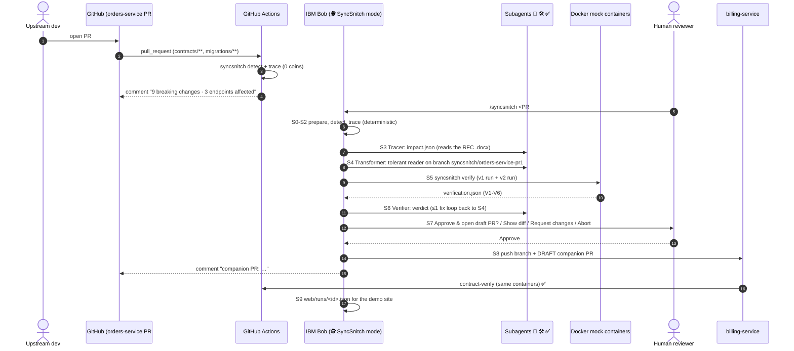
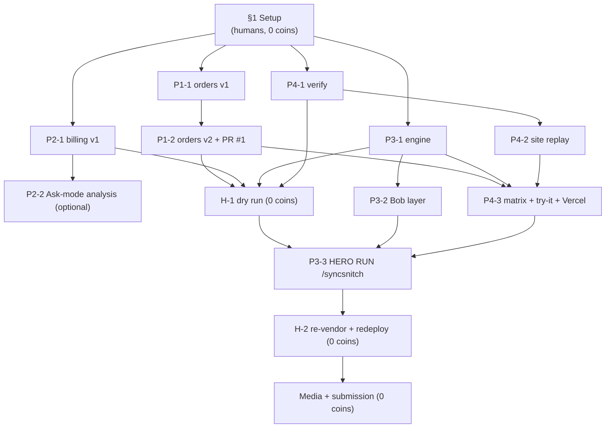

# SyncSnitch — Complete Workflow

This file explains **what happens** (the product's runtime workflow) and **who does what, when** (the team's 48-hour build workflow).
- Architecture details: [ARCHITECTURE.md](ARCHITECTURE.md)
- Exact prompts: [WORK.md](WORK.md)
- Features: [FEATURES.md](FEATURES.md)

---

## Part A — The product workflow: what happens when an upstream PR lands

### A.1 The story in 60 seconds
1. The **Orders team** opens PR #1 in `orders-service`. In one go it changes the REST payload (money becomes minor units, customer becomes an object), the gRPC message and the database migration, and renames `PENDING` to `AWAITING_PAYMENT`.
2. A **GitHub Action** notices contract files changed and runs SyncSnitch's deterministic detector and tracer. It comments on PR #1: *"9 breaking changes. `billing-service` is affected in 5 files and 3 endpoints."* This costs 0 Bobcoins.
3. A developer types **`/syncsnitch <PR #1 URL>`** in **IBM Bob**. Bob's SyncSnitch mode runs the S0–S9 workflow.
   - Three **subagents** do the reasoning:
     - 🔎 Tracer builds the impact map, reading the upstream team's RFC `.docx`.
     - 🛠️ Transformer writes a tolerant-reader adapter in `billing-service`.
     - ✅ Verifier judges the results.
   - **Docker mock containers** prove the adapter against the old **and** new contract.
4. Bob **asks the human**: approve, see the diff, request changes, or abort.
5. On approval, a **draft companion PR** opens in `billing-service` and is linked from PR #1. Its CI re-runs the containers and goes green.
6. Result: the upstream team can deploy v2 without breaking billing.
   - The *loud* failures are caught: HTTP 500s from the missing fields and the dropped column.
   - So are the *silent* ones: payments reading an amount of 0 through old gRPC stubs, and unpaid orders that would have been invoiced.

### A.2 Sequence

### A.3 Step by step, with what you will see
| Step | Type | Command / actor | Output | Example |
|---|---|---|---|---|
| **S0** prepare | deterministic | `gh pr view … --json number,headRefName,baseRefName`; fetch; `touch .syncsnitch/ACTIVE` | PR_NUMBER=1, HEAD_REF=feat/orders-v2, RUN_ID=r-20260926-101500 | — |
| **S1** detect | deterministic, 0 coins | `uv run syncsnitch detect --upstream ../orders-service --base main --head feat/orders-v2 --run-id <RUN_ID>` | `drift.json` | `rest:Order.total_price:property_removed` · `grpc:orders.OrderSummary.3:field_removed` · `db:orders.total_price:column_dropped` … **9 breaking** |
| **S2** trace | deterministic, 0 coins | `uv run syncsnitch trace --run-id <RUN_ID> --consumer ../billing-service` (+ copies the RFC `.docx` into the run folder) | `candidates.json` | `billing/services/invoice.py:6 "PENDING" [literal] → POST /invoices/{order_id}` · `billing/services/payments.py … total_price [attribute] → GET /payments/{order_id}/status` · `billing/reports/revenue.sql:1 total_price → GET /reports/revenue` |
| **S3** 🔎 Tracer | AI subagent | reads drift, candidates, the consumer files and the RFC `.docx` | `impact.json` | mapping `total_price → total.amount_minor (×100)`; 3 endpoints (2 loud, 1 silent) + the hidden `PENDING` bug; migration notes quoting RFC-042 §5–§6 |
| **S4** 🛠️ Transformer | AI subagent | follows the tolerant-reader rules on branch `syncsnitch/orders-service-pr1` | commit on the branch | `billing/adapters/orders_contract.py`, updated invoice/payments/revenue, consumer-compat `orders.proto` + regenerated stubs, v2 fixtures, `.syncsnitch.json` |
| **S5** verify | deterministic, 0 coins, 3–6 min | `uv run syncsnitch verify …` | `verification.json`, `VERIFICATION.md` | V1 ✅ · V2 ✅ · V3 ✅ (v1 5/5) · V4 ✅ (v2 5/5) · V5 ✅ · V6 ✅ |
| **S6** ✅ Verifier | AI subagent | reads verification.json | `verdict.json` | `{"verdict": "green", "reasons": [...]}`. If red: fix instructions → S4 (max 1 loop) |
| **S7** gate | **human** | Bob asks with 4 choices | decision | "Show full diff" → review → "Approve & open draft PR" |
| **S8** PR | deterministic | `syncsnitch report --format pr` + `scripts/open_companion_pr.sh …` | draft PR + comment on PR #1 | `COMPANION_PR_URL=https://github.com/kshiti26-11/billing-service/pull/1` |
| **S9** artifact | deterministic | `syncsnitch run-artifact …`; `rm .syncsnitch/ACTIVE` | `web/runs/<RUN_ID>.json` | the website now replays this run |

**Before vs after (the proof):**

| `syncsnitch verify` | V1 unit | V2 v2-fixtures | V3 containers v1 | V4 containers v2 | V5 Prism | V6 scope |
|---|---|---|---|---|---|---|
| **Before** (H-1 dry run, billing `main`) | ✅ | ❌ none yet | ✅ 5/5 | ❌ 0/5 | ❌ | ✅ |
| **After** (companion branch) | ✅ | ✅ | ✅ 5/5 | ✅ 5/5 | ✅ | ✅ |

### A.4 What runs where
| Where | What |
|---|---|
| Developer's laptop (IBM Bob + Docker) | the `/syncsnitch` run: S0–S9, including the containers in S5 |
| GitHub Actions (upstream PR) | automatic drift comment (detect + trace), no AI |
| GitHub Actions (companion PR) | the same container verification, as a required-looking status check |
| Vercel | the public demo website: replay of the recorded run, live REST matrix, try-it sandbox |

---

## Part B — The team workflow: 48 hours, 4 people, 40 Bobcoins

### B.1 Build order (dependencies)

### B.2 Timeline (T0 = your kickoff; the hard deadline is **Sep 27 2026, 15:00 UTC**)
Put the sleep block in your local night. **Submit by T+42.5**, which leaves at least 5 hours of buffer.

| T+ | Person 1 (Upstream) | Person 2 (Downstream) | Person 3 (Agent + Bob) | Person 4 (Verify + Site) |
|---|---|---|---|---|
| 0:00–0:45 | §1.1 account-owner steps (if you own `kshiti26-11`), tools, clones | tools, clones, **§1.6 rules check** | tools, clones, Bobalytics baseline, ledger | tools, clones, Vercel account |
| 0:45–4:00 | **P1-1** | **P2-1** | **P3-1** | **P4-1** |
| 4:00–6:00 | **P1-2** → PR #1 | **P2-2** (optional) | **P3-2**, **ledger check (≤20 coins?)** | **P4-2** |
| 6:00–9:00 | video script, shot list | deck outline, cover image | **H-1 dry run** (0 coins), before-screenshot | **P4-3** + Vercel deploy |
| 9:00–12:00 | help with fixes (F-n) | `bob_sessions` hygiene | buffer / fixes | smoke tests, `DEMO_URL` variable |
| **12:00–13:00** | **Integration checkpoint**: everyone confirms their acceptance results; ledger update; go / lean decision | ← | ← | ← |
| 13:00–15:00 | help record | help record | **P3-3 HERO RUN, screen-recorded** | records the website; **H-2** |
| 15:00–19:00 | slides | slides | fixes from the reserve only if needed | video rough cut |
| 19:00–20:00 | triage: freeze scope | ← | ← | ← |
| 20:00–25:00 | **sleep** (the site stays up on Vercel) | | | |
| 25:00–31:00 | video narration | deck final + cover | README (P3-4 or by hand), LICENSE | video edit; lock the demo URL at T+31 |
| 31:00–38:00 | proofread everything | `bob_sessions` completeness check | evidence index | final smoke test, health workflow green |
| 38:00–41:00 | **final QA**: click every link, watch the video once, open the site in incognito, confirm the repos are public | ← | ← | ← |
| **41:00–42:30** | reads every field back | — | — | **submits on lablab** |
| 42:30–48:00 | buffer: platform issues only | | | |

### B.3 Checkpoints (definition of done)
| When | Must be true |
|---|---|
| **After Round 1** | all four acceptance results match WORK.md; Round 1 coins ≤ 20 (otherwise lean mode, WORK.md §5) |
| **After H-1** | detect = 9 breaking; verify: V1 ✅ V3 ✅ V4 ❌ (the break is proven) |
| **After P4-3** | the Vercel URL serves `/`, `/runs`, `/matrix`, `/try`; the smoke test passes |
| **After P3-3** | a draft companion PR exists and is linked from PR #1; its `contract-verify` check is green; `web/runs/r-*.json` is committed |
| **After H-2** | matrix after×v2 ✅ on the live site |
| **Before submission** | every prompt exported in `bob_sessions/exports/`, hero screenshots present, README links work, video ≤ limit, all 3 repos public |

### B.4 Where the 40 coins go
| Activity | Coins | Why this amount |
|---|---|---|
| 10 build prompts (Rounds 1–3) | ≈ 26 | exact specs + `cp` of validated boilerplate = few turns, short contexts |
| Hero run P3-3 | ≈ 6 | only S3, S4 and S6 use the model; S1, S2, S5, S8 and S9 are free |
| Reserve (fixes, optional P3-4) | ≈ 8 | one F-n ≈ 1 coin |
| Automatic CI comments, container verification, website | 0 | deterministic |

**Tips that save the most:**
- Start a new task per prompt.
- Keep MCP off.
- Never ask Bob to "look around".
- Paste only the failing lines into fixes.
- Record the first hero run so you never need a second one.

### B.5 Demo-day flow (recording)
1. `bash scripts/reset_demo.sh`. This is a dry run; add `--apply` only if a previous hero run needs undoing.
2. Record the website first: home → `/matrix` (before×v2 red) → `/try`. This costs 0 coins.
3. Record H-1's `VERIFICATION.md` (before: V4 ❌).
4. Record **P3-3**: the mode picker → `/syncsnitch …` → subagents working → verification table → the **approval question** → draft PR page → PR #1 comment → green `contract-verify` check.
5. After H-2: `/matrix` again (after×v2 green) → `/runs/<id>` replay.
6. Close on Bobalytics: coins spent vs. deterministic steps (the cost story).

**Suggested video beats (3:30):**

| Time | Beat |
|---|---|
| 0:00 | hook |
| 0:20 | problem: loud vs silent |
| 0:40 | PR #1 |
| 1:00 | live break |
| 1:20 | `/syncsnitch` in Bob |
| 2:20 | human gate + draft PR |
| 2:40 | the companion PR |
| 3:00 | green matrix |
| 3:15 | value + roadmap |

### B.6 Submission checklist (confirm the exact fields in the rules check, WORK.md §1.6)
Title · short description · long description · tags (IBM Bob, Python, FastAPI, gRPC, Docker, GitHub Actions, Vercel) · 16:9 cover image · video link · slide deck (PDF) · public repo `https://github.com/kshiti26-11/demo` (links to both service repos) · demo URL (Vercel) · `bob_sessions/` with exported task histories and screenshots.

---

## Part C — Troubleshooting
| Symptom | Cause | Fix |
|---|---|---|
| `git push -u origin main` fails in a new service repo | the local branch isn't `main` | `git symbolic-ref HEAD refs/heads/main` (the prompts already do this) |
| `ModuleNotFoundError: orders_pb2` / `app` | an absolute import in generated or own code | re-run `scripts/gen_proto.py` / `scripts/regen_stubs.py`; use relative imports |
| Docker build is slow or huge | `.venv` in the build context | the `.dockerignore` from the template must be committed |
| Prism container exits at once | multi-process bug in the image | keep `--multiprocess=false` (already in `verify/docker-compose.yml`) |
| V2 fails after the hero run | fixture names | the Transformer must add `tests/fixtures/order_v2_paid.json` and `order_v2_unpaid.json` |
| V6 fails | the Transformer touched other paths | revert those files on the branch; re-run S5 |
| The PR #1 check fails right after it's opened | the engine wasn't pushed yet | re-run the job after P3-1 is on `main` |
| Reusable workflow "not found" | `kshiti26-11/demo` is private or the docs PR isn't merged | make it public; merge to `main` |
| Vercel 500 on `/matrix` | a module imported grpc/pb2 at import time | REST modules must import gRPC lazily |
| Coins running out | long tasks / exploration | lean mode (WORK.md §5); reuse the first hero-run recording |
